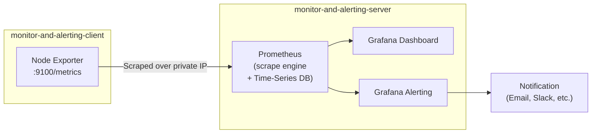

# Intro to Prometheus

A simple question to kick things off: what is Prometheus? By the end of this file, you'll know exactly what it does, why teams rely on it, and how metrics flow from your service all the way to an alert on your phone.

## So, what is Prometheus?

Prometheus is a **monitoring and alerting toolkit**. Simple enough to say, but what does that actually mean in practice?

Basically, it collects **metrics** from configured targets at regular intervals, evaluates rules against those metrics, shows you the results, and can trigger alerts when something crosses a threshold you care about.

## Let's break it down with a real scenario

Imagine you're working on a project, and some of your services are live in production. Suddenly, one of them stops responding.

Here's the thing, the first thing your senior engineer asks isn't "what's broken", it's usually: "What's the status of your service? Is it up or down?"

What they're really asking is: "Check the system metrics and tell me if the service is healthy or not." And that's exactly the gap Prometheus fills.

- It **monitors your services** continuously.
- It **alerts you** the moment something looks off, often before a user even notices.

So basically, Prometheus emits metrics (CPU usage, memory usage, request count, and so on) from your services and stores them in a time-series database, a database built specifically to handle data points over time.

## Ok, now what do we do with these metrics?

Good question. Once metrics are being collected, you've got two things you can do with them:

1. **Visualize them** in a dashboard, Grafana being the most common choice (we'll set this up in a later file).
2. **Set up alerts** so you get notified when something crosses a threshold you define.

For example: "Hey, alert me when the CPU usage of my service goes above 80% for 5 minutes straight." That's a real, practical alert you can configure, not just a theoretical idea.

## The flow, visualized

Here's the high-level picture of how metrics move through Prometheus, from your service all the way to a Slack ping:

Your service emits metrics, Prometheus scrapes and stores them, and from there, you either look at them on a dashboard or let the alerting system watch them for you.

## Recap

- Prometheus is a monitoring and alerting toolkit that collects metrics from your services.
- It stores those metrics in a time-series database.
- You can visualize the metrics (usually via Grafana) or set up alerts based on thresholds.
- The whole flow: service emits metrics → Prometheus collects and stores them → dashboards or alerts consume them.

## What's next

That's enough theory. In the next file, we'll actually get our hands dirty: spin up a server, install Prometheus, and start collecting real metrics.
