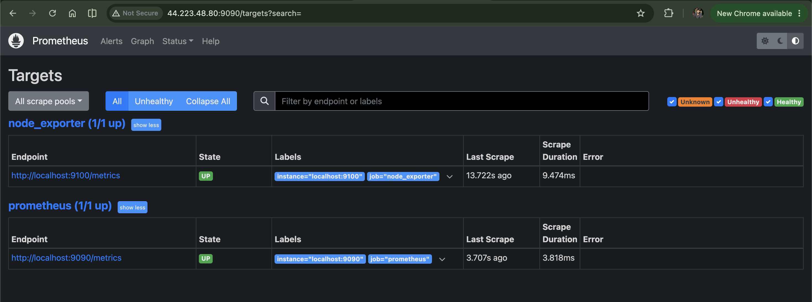
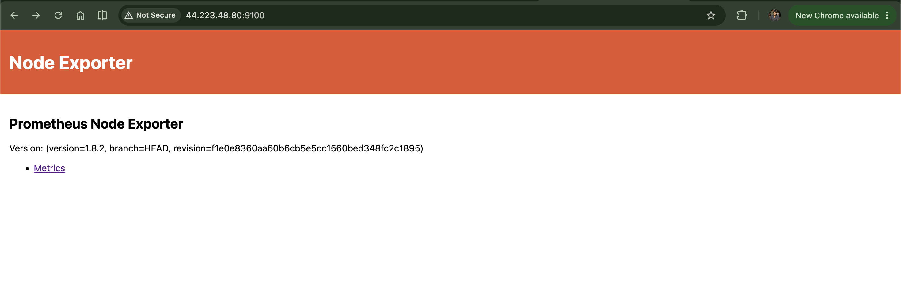
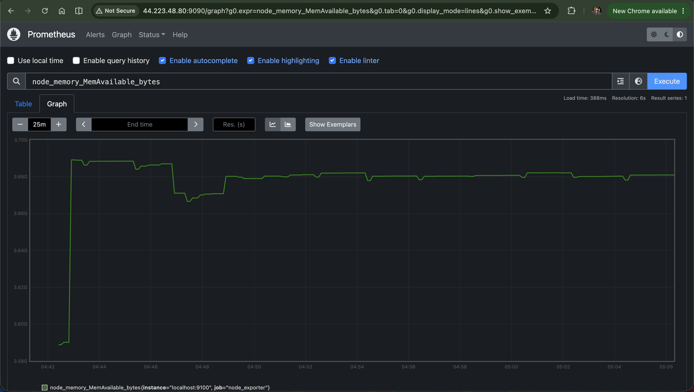

# Prometheus Setup

Time to move from theory to practice. In this file, we'll spin up a server, install Prometheus and Node Exporter on it, and actually view live system metrics being scraped in real time.

## A quick note on real-world setups

In a real production environment, Prometheus, Grafana, and Alertmanager are usually deployed on separate servers, each doing its own job. But for the sake of cost and simplicity while learning, we'll run all of them on a single server instead.

## Step 1: Create your server

Go ahead and create one `t2.medium` EC2 instance in AWS, and name it `monitoring-and-alerting-server`. This single instance is going to host Prometheus, and later, Grafana too.

## Step 2: Install Prometheus and Node Exporter

Copy the [install-prometheus.sh](../scripts/install-prometheus.sh) script onto your `monitoring-and-alerting-server` instance and run it.

What do you think this script actually does? Here's a quick breakdown so you're not just blindly running a script:

| Step | What it does |
| --- | --- |
| Downloads and extracts Prometheus | Grabs the official binary release from GitHub |
| Creates a dedicated `prometheus` system user | Keeps Prometheus running with limited privileges, not root |
| Moves binaries to `/usr/local/bin` | Makes `prometheus` and `promtool` available system-wide |
| Writes `/etc/prometheus/prometheus.yml` | The config file telling Prometheus what to scrape and how often |
| Installs Node Exporter | A separate tool that exposes system-level metrics (CPU, memory, disk, network) for Prometheus to scrape |
| Creates systemd services | So both Prometheus and Node Exporter start automatically and stay running in the background |

Node Exporter, by the way, is what actually generates the raw system metrics. Prometheus itself doesn't know your CPU usage, it just knows how to scrape metrics from something that does, and Node Exporter is that something.

## Step 3: Access Prometheus

Once the script finishes, open these two URLs in your browser:

- `http://<your-server-ip>:9090/targets`
- `http://<your-server-ip>:9100`

If you can't reach either page, here's what's happening: your Security Group is blocking the ports. Fix it like this:

1. Go to the Security Group attached to your `monitoring-and-alerting-server` instance.
2. Add inbound rules for ports `9090` and `9100`, with source set to `Anywhere-IPv4`.
3. Save the changes.

A quick word of caution: in a real production setup, you'd never open ports to `Anywhere-IPv4`, you'd restrict access to your own IP or a trusted range. We're opening it wide here purely to make learning easier, not because it's a good practice to carry into production.

    
    

## Step 4: Look at the raw metrics

Head to `http://<your-server-ip>:9100/metrics` and you'll see a wall of raw metrics being generated by Node Exporter. This is the unprocessed data Prometheus is scraping every 15 seconds (that interval is set in the config file we saw earlier).

## Step 5: Visualize a metric

Raw text is hard to read, so let's actually graph one. Here's how:

1. Go to the **Graph** tab in Prometheus.
2. Type a metric name into the **Expression** field.
3. Click **Execute**.

Not sure what to try first? Here are a few useful ones to experiment with:

| Metric name | What it tells you |
| --- | --- |
| `node_cpu_seconds_total` | Total seconds the CPU spent in each mode (idle, user, system, etc.) |
| `node_memory_MemAvailable_bytes` | How much memory is currently available |
| `node_network_receive_bytes_total` | Total bytes received over the network |
| `node_disk_io_time_seconds_total` | Total time spent on disk I/O |
| `node_filesystem_avail_bytes` | Available space on the filesystem |

That's it. You now have a fully working Prometheus setup, collecting real metrics from your server and letting you graph them on demand.

## Recap

- Prometheus and Node Exporter both run on one EC2 instance for this guide, though production setups usually separate them.
- `install-prometheus.sh` installs Prometheus, sets up Node Exporter, and configures both as systemd services.
- Port `9090` is Prometheus itself, port `9100` is Node Exporter's raw metrics endpoint.
- You can graph any metric using the Expression field in Prometheus's Graph tab.

## What's next

Prometheus's built-in graphs work, but they're pretty bare-bones. In the next file, we'll set up Grafana, a proper dashboarding tool that turns these same metrics into something you'd actually want to look at every day.
