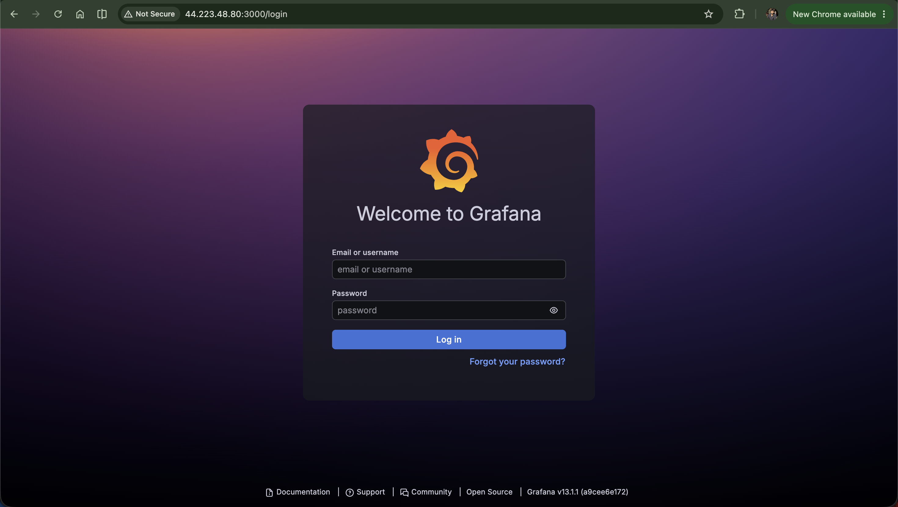
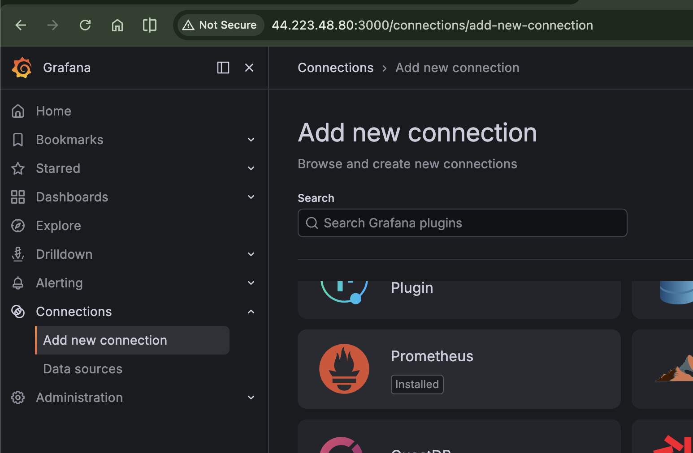
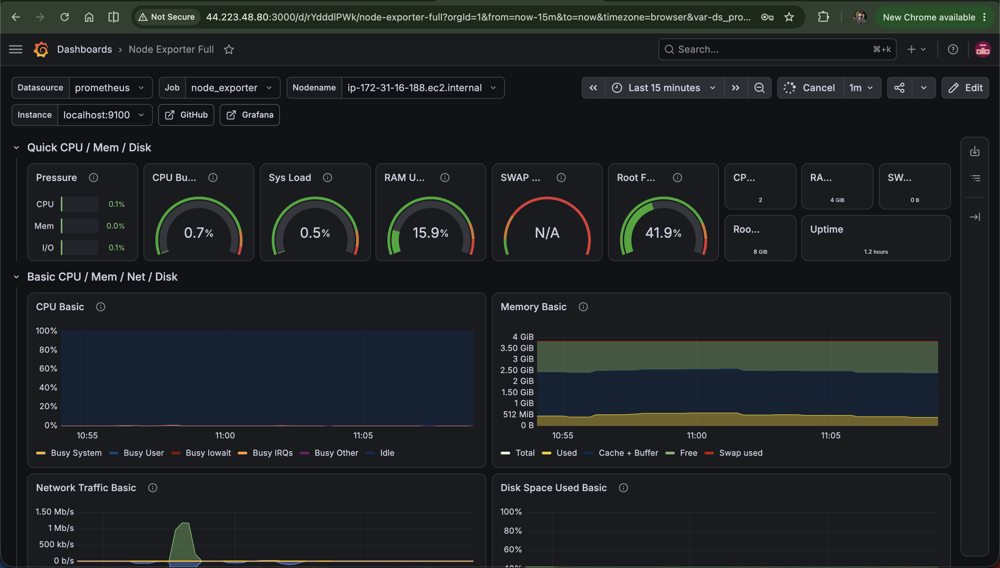
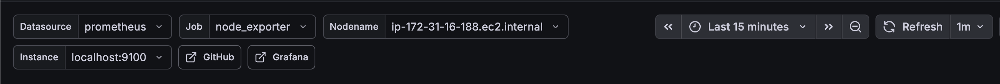

# Grafana Setup


We've got Prometheus collecting metrics and graphing them one at a time. In this file, we'll install Grafana, connect it to Prometheus, and import a ready-made dashboard that visualizes everything at once, no manual graph-building required.

## Wait, why do we need Grafana if Prometheus already graphs things?

Fair question. Prometheus's Graph tab works, but it's built for quick, one-off checks, not for a proper, always-on view of your system. That's exactly the gap Grafana fills.

Grafana is a **dashboarding tool**. It takes the same metrics Prometheus already has and displays them in a much more user-friendly way, with dashboards, panels, and alerts you can build once and reuse forever.

Here's how the two actually compare:

| Aspect | Prometheus | Grafana |
| --- | --- | --- |
| Primary role | Metrics collection and storage (time-series DB) | Visualization and dashboarding layer |
| Data collection | Pulls or scrapes metrics from exporters on an interval | None, it reads from external sources like Prometheus |
| Querying | PromQL, with a basic built-in graph UI | Same PromQL, with a much richer panel builder UI |
| Dashboards | Minimal, not persistable, single data source | Persistent, shareable, multi-panel, importable |
| Alerting | Yes, via Alertmanager (config-file driven) | Yes, with a friendlier UI on top of similar rule logic |
| Data sources | Only its own scraped metrics | Multiple at once, Prometheus, Loki, Tempo, MySQL, and more |
| Best for | Being the source of truth for metrics data | Turning that data into something you'd actually look at daily |

**In short:** Prometheus collects and stores, Grafana visualizes and alerts. They're complementary tools, not competitors.

## Installing Grafana

Copy [install-grafana.sh](../scripts/install-grafana.sh) onto your `monitoring-and-alerting-server` instance (the same one running Prometheus) and run it.

Once it finishes, access it at:

```
http://<your-server-ip>:3000
```

If the page doesn't load, you already know the drill from the last file: open your Security Group and add an inbound rule for port `3000`. This time, set the source to `My IP` instead of `Anywhere-IPv4`, since Grafana is where you'll actually be logging in with credentials, so there's no reason to leave it wide open.



## Logging in for the first time

On the login page, use the default credentials:

- **Username:** `admin`
- **Password:** `admin`

You'll immediately be prompted to change the password. Go ahead and set something secure, and make sure you remember it, you'll need it every time you log back in.

## Connecting Grafana to Prometheus

Grafana doesn't collect any metrics on its own, remember, so the first thing to do is tell it where to pull data from.

1. Go to the left menu: **Connections** → **Data sources** → **Add data source** → **Prometheus**.
2. In the URL field, enter `http://localhost:9090`.



If that URL looks familiar, it should, it's the exact address we used to access Prometheus directly in the last file. Since Grafana and Prometheus are running on the same server here, `localhost` works fine.

3. Click **Save & Test**. You should see a confirmation that the connection works.

## Importing a pre-built dashboard

Now, head to **Dashboards** → **New** → **Import Dashboard**, and enter the dashboard ID `1860`, then click **Load**.

You might be wondering, where did `1860` come from? We didn't build this dashboard ourselves. Here's the deal:

- Grafana has a huge library of [community pre-built dashboards](https://grafana.com/grafana/dashboards/) that anyone can import and use instantly.
- `1860` specifically is the ID for [Node Exporter Full](https://grafana.com/grafana/dashboards/1860), a dashboard built specifically to visualize the exact metrics Node Exporter exposes.
- You can absolutely build your own dashboards from scratch later, but for learning purposes, importing a battle-tested one is a much faster way to see real value immediately.

As soon as you import it, you'll see a huge jump in what's visible, dozens of metrics laid out in one clean view, compared to the one-graph-at-a-time experience in Prometheus.



## Understanding the dashboard controls

At the top of the dashboard, you'll notice a row of dropdowns. These control what data the dashboard actually shows.



| Field | Value shown | What it means |
| --- | --- | --- |
| **Datasource** | `prometheus` | Which data source to pull metrics from. Since we've only added one, this stays fixed. |
| **Job** | `node_exporter` | Matches the `job_name` set in `prometheus.yml`. This tells the dashboard to only show metrics scraped by the `node_exporter` job, not the `prometheus` job. |
| **Nodename** | `ip-172-31-16-188.ec2.internal` | The hostname of the machine being monitored, auto-detected from the `node_uname_info` metric. |
| **Instance** | `localhost:9100` | The exact scrape target (host:port) this data came from, matching the `targets` line in your Prometheus config. |
| **Time range** | `Last 15 minutes` | Shows only the most recent 15 minutes of data across all panels. You can widen this to 1h, 24h, 7d, and so on. |
| **Refresh** | `1m` | Auto-refreshes all panels every minute, so you get near-live data without reloading the page manually. |

## Recap

- Grafana visualizes what Prometheus collects, they're complementary, not competing tools.
- Add Prometheus as a data source using `http://localhost:9090` when both run on the same server.
- Dashboard ID `1860` (Node Exporter Full) gives you a complete, ready-made dashboard instantly.
- The top dropdowns (Datasource, Job, Nodename, Instance, Time range, Refresh) control exactly what data you're looking at.

## What's next

Right now, we're only monitoring the one server everything is running on. In the next file, we'll look at how to monitor multiple instances at once, the manual way first, so you understand exactly what's happening under the hood.
