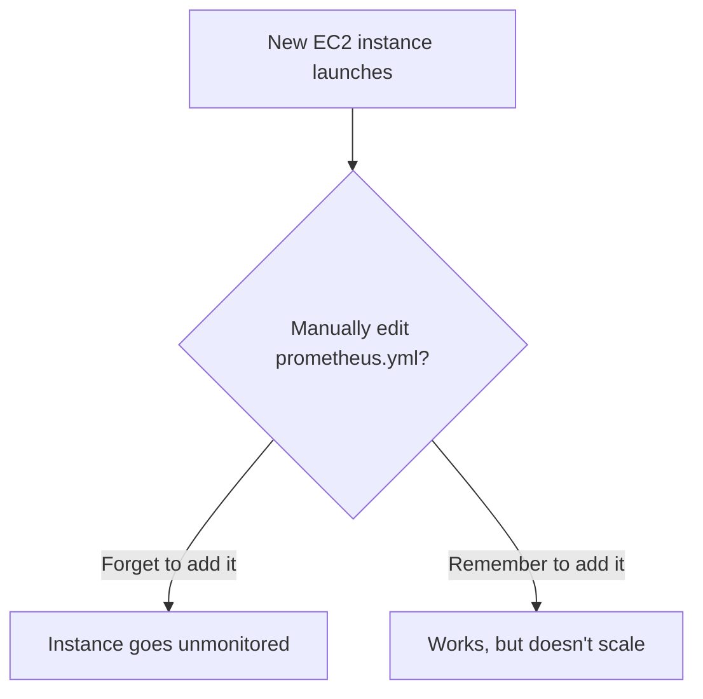

# Monitoring Multiple Instances


So far, we've only monitored the single server everything is running on. In this file, we'll manually add more instances to Prometheus's watch list, and understand exactly why this approach doesn't scale, setting up the motivation for the next file.

## The current setup

Right now, Prometheus is scraping metrics from just one target: the Node Exporter running on the same instance it's installed on (`localhost:9100`). But in any real infrastructure, you're not running one server, you're running many, and you'll want to monitor all of them.

## Adding more targets manually

Head to `/etc/prometheus/prometheus.yml` on your Prometheus server and look at the `scrape_configs` section, the same one we set up while running `install-prometheus.sh` earlier.

You can add multiple entries under the `targets` list for the `node_exporter` job, like this:

```yaml
scrape_configs:
  - job_name: 'node_exporter'
    static_configs:
      - targets: ['localhost:9100', '<instance-1-private-ip>:9100', '<instance-2-private-ip>:9100']
```

Each entry here points to a different machine's Node Exporter endpoint. Add as many as you need, and Prometheus will scrape all of them on the same interval.

## Why private IP, not public IP?

You might notice we're using **private IPs** here, not public ones. This is intentional:

- Private IPs keep traffic between your instances inside AWS's internal network, faster and more secure.
- Public IPs would route this traffic over the public internet, unnecessarily exposing your metrics endpoint and adding latency.

If you want to go deeper on the difference between public, private, and elastic IPs, [this breakdown](https://github.com/dharmarajrdr/All-About-AWS/blob/main/04-networking-and-vpc/01-ip-addresses-explained.md#2-the-three-types-side-by-side) covers it well.

## So, what's the problem here?

This static config approach works, and honestly, for two or three servers, it's perfectly fine. But think about it: what happens once your infrastructure grows to 20, 50, or 100 instances?

- Every time a new server spins up, you'd need to manually edit `prometheus.yml` and add its private IP.
- Every time a server gets terminated, you'd need to remember to remove it, or Prometheus keeps trying (and failing) to scrape a target that no longer exists.
- In a team setting, this becomes a constant, error-prone chore that nobody wants to own.



So basically, manually maintaining a target list works for a lab environment, but it falls apart fast in any real, growing infrastructure.

## Recap

- You can manually list multiple scrape targets under `static_configs` in `prometheus.yml`.
- Always use private IPs between instances within the same network, not public IPs.
- Manually maintaining this list doesn't scale, new instances get missed, and terminated ones linger.

## What's next

What if Prometheus could figure out which instances to monitor on its own, automatically, the moment a new one spins up? That's exactly what we'll build in the next file using AWS EC2 **Service Discovery**.
