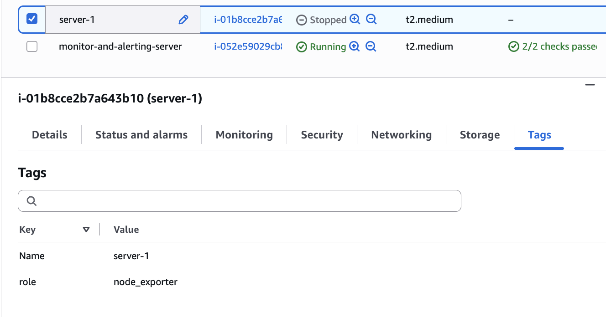
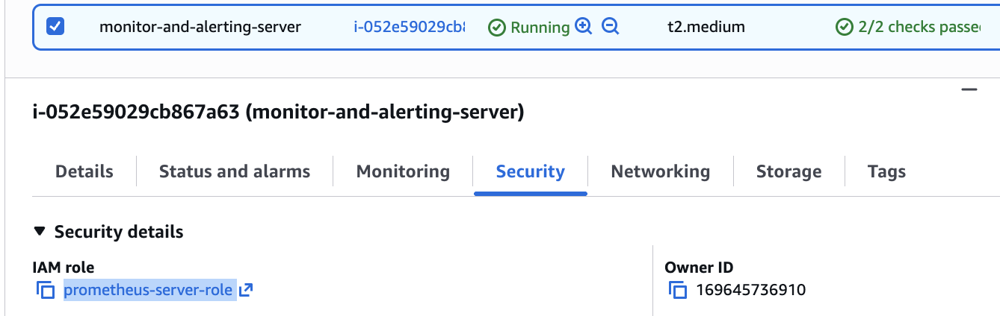
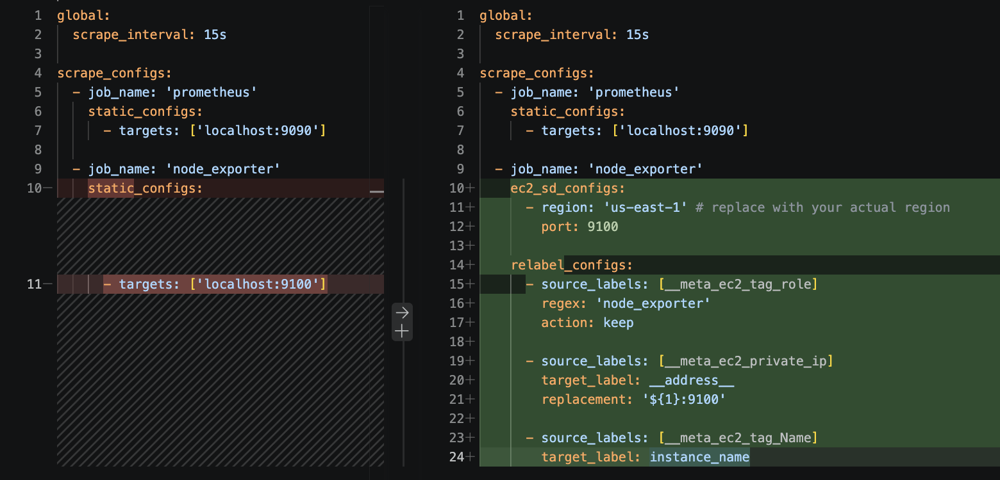
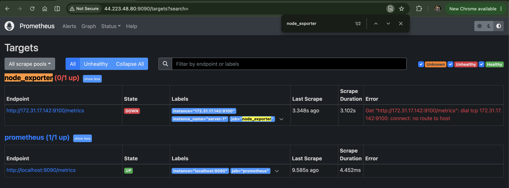
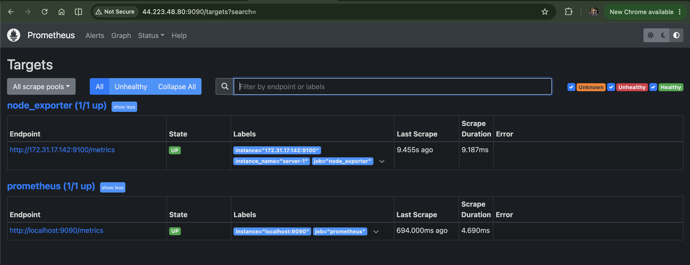
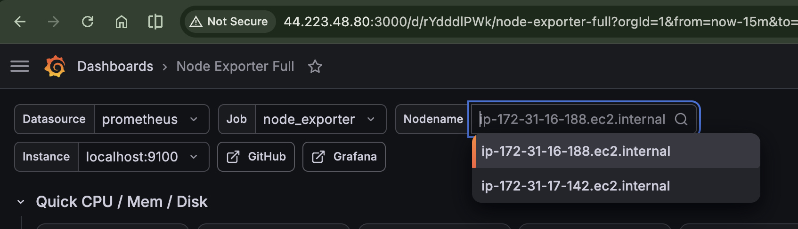
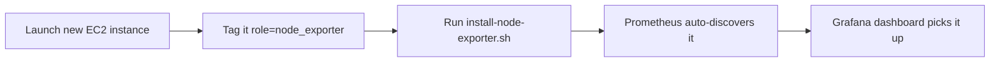

# Service Discovery


In the last file, we saw why manually listing every instance in `prometheus.yml` doesn't scale. In this file, we'll fix that properly using AWS EC2 Service Discovery, so Prometheus automatically finds and monitors any instance you tag, with zero manual config edits.

## The idea

Instead of hardcoding IPs, we're going to tell Prometheus: "Go ask AWS which instances exist, and automatically monitor any of them tagged a certain way." From that point on, spinning up a new server to monitor becomes a two-step process: tag it, install Node Exporter, done.

## Step 1: Tag the instances you want monitored

For every instance you want Prometheus to pick up automatically, add a tag:

```
role = node_exporter
```



Do this for each instance you want discovered. Untagged instances will simply be ignored.

## Step 2: Create an IAM policy

Prometheus needs permission to actually ask AWS which instances exist. Go to **IAM** → **Policies** → **Create policy** → **JSON**, and paste in:

```json
{
    "Version": "2012-10-17",
    "Statement": [
        {
            "Effect": "Allow",
            "Action": [
                "ec2:DescribeInstances"
            ],
            "Resource": "*"
        }
    ]
}
```

Give this policy a clear name, like `prometheus-ec2-discovery`, and save it. This policy does exactly one thing: it allows whoever holds it to list EC2 instances and read their metadata, including private IPs. Nothing more, nothing destructive.

## Step 3: Create an IAM role and attach the policy

Now go to **IAM** → **Roles** → **Create role** → **AWS service** → **EC2** → **Next: Permissions**, and attach the `prometheus-ec2-discovery` policy you just created. Name the role something like `prometheus-server-role`.

## Step 4: Attach the role to your Prometheus server

Go to your `monitoring-and-alerting-server` instance → **Actions** → **Security** → **Modify IAM role**, and attach `prometheus-server-role` to it.



This step matters: it's what gives your Prometheus server actual permission to query AWS on its own, without you handing it any credentials manually.

## Step 5: Update the Prometheus config

Now, head to `/etc/prometheus/prometheus.yml` (using `sudo`, since it's owned by the `prometheus` user) and replace the existing config with the updated version in [prometheus.yml](../scripts/prometheus.yml):

```yaml
global:
  scrape_interval: 15s

scrape_configs:
  - job_name: 'prometheus'
    static_configs:
      - targets:
          - 'localhost:9090'

  - job_name: 'node_exporter'
    ec2_sd_configs:
      - region: 'us-east-1' # replace with your actual region
        port: 9100

    relabel_configs:
      - source_labels: [__meta_ec2_tag_role]
        regex: 'node_exporter'
        action: keep

      - source_labels: [__meta_ec2_private_ip]
        target_label: __address__
        replacement: '${1}:9100'

      - source_labels: [__meta_ec2_tag_Name]
        target_label: instance_name
```



Let's break down what actually changed here, since it's easy to gloss over:

- We swapped `static_configs` for `ec2_sd_configs` (EC2 Service Discovery), telling Prometheus to query AWS directly instead of reading a hardcoded list.
- The first `relabel_configs` block **keeps only instances tagged `role=node_exporter`**, discarding everything else, including the Prometheus server itself if it's untagged.
- The second block rewrites the scrape address to `<private_ip>:9100`, so Prometheus knows exactly where to hit each discovered instance.
- The third block adds a readable `instance_name` label, pulled from each instance's Name tag, so Grafana shows actual names instead of raw IP addresses later.

## Step 6: Restart Prometheus

```bash
sudo systemctl restart prometheus
```

Head to `http://<your-server-ip>:9090/targets` and you should see every instance tagged `role=node_exporter` automatically discovered.



## Wait, why are they showing as DOWN?

Good catch if you noticed this. What do you think is causing it?

The answer: these are freshly created instances, and we haven't installed Node Exporter on them yet. Prometheus found them just fine, it's just got nothing to actually scrape yet.

## Step 7: Install Node Exporter on each discovered instance

Go to each instance currently showing `DOWN`, and run the [install-node-exporter.sh](../scripts/install-node-exporter.sh) script on it.



Once that's done, refresh the targets page. Every instance should now show as `UP`, and Prometheus is actively scraping metrics from all of them.

Head back to Grafana and refresh your dashboard, you'll now see all your instances available in the **Nodename** dropdown.



## The workflow going forward

This is the real payoff. From here on, monitoring a brand new instance takes exactly two steps:



1. Create the instance and tag it `role=node_exporter`.
2. Run `install-node-exporter.sh` on it.

That's it. No config file edits, no restarting Prometheus manually for every new server, no risk of forgetting to remove a terminated instance's stale entry.

## Recap

- EC2 Service Discovery lets Prometheus automatically find instances by tag, instead of relying on a hardcoded list.
- It needs an IAM policy (`ec2:DescribeInstances`) and role attached to the Prometheus server to query AWS.
- `relabel_configs` filters discovered instances by tag, sets the correct scrape address, and adds readable names.
- Newly discovered instances show as `DOWN` until Node Exporter is actually installed on them.

## Wrapping up the series

That covers the full journey: understanding what Prometheus does, setting it up, visualizing metrics with Grafana, and scaling to monitor an entire fleet of instances automatically with Service Discovery. You went from "what even is Prometheus" to running a genuinely production-style monitoring setup.

One last thing before you close this out: **stop the EC2 instances you created for this guide** to avoid racking up unnecessary charges on your AWS account.
